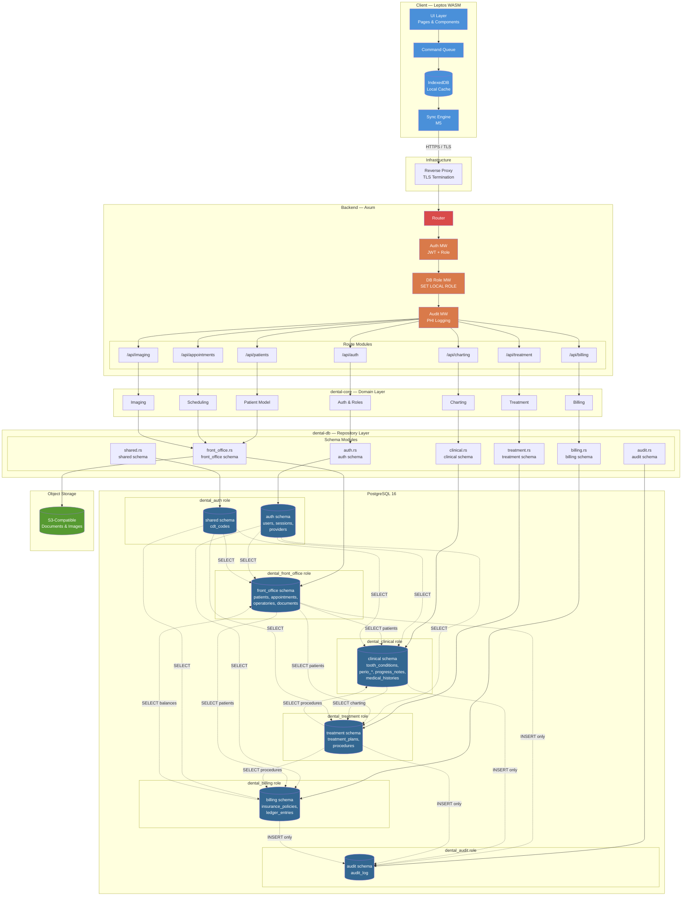

# Prompt: milestone-0-chief-architect-ai-2026-02-15-2

## Input
This looks good, the only addition I want to make is to restructure the project to have Postgres user role boundaries. Each role will be responsible for one schema within the project. The idea being that other users cannot access data in other schemas they don't belong to. The idea being is we might want to microservice our backend in the future.

## Output

# Architectural Proposal v2 — Dental Practice Management System
## Schema-Per-Role with Microservice-Ready Boundaries

This is an evolution of v1. Everything from the previous proposal (tech stack, Rust workspace, Leptos frontend, CI/CD, offline architecture) remains. This document focuses on the **restructured database layer** and its implications for the Rust crate layout, connection management, and future microservice extraction.

---

## 1. Core Concept: One Postgres Schema Per Role Boundary

Instead of a single `public` schema, the database is partitioned into **five schemas**, each owned by a dedicated Postgres role. Application-level user roles map to these database roles, and Postgres itself enforces that a connection using a given role **cannot see or touch tables in schemas it has no grants for**.

This gives us **two layers of access control**:
1. **Application layer** — Axum middleware + `Role::has_permission()` (unchanged from v1)
2. **Database layer** — Postgres role + schema grants (new in v2)

If the application layer has a bug, the database layer still blocks unauthorized access. Defense in depth.

### Schema Map

| Postgres Schema | Owning DB Role | App Role(s) | Domain | Tables |
|---|---|---|---|---|
| `auth` | `dental_auth` | Admin | Identity & access | `users`, `sessions`, `providers` |
| `front_office` | `dental_front_office` | Receptionist | Patient registration, scheduling, documents | `patients`, `appointments`, `operatories`, `documents`, `appointment_types` |
| `clinical` | `dental_clinical` | Hygienist | Charting, perio, notes, medical history | `tooth_conditions`, `perio_exams`, `perio_measurements`, `progress_notes`, `medical_histories` |
| `treatment` | `dental_treatment` | Dentist | Diagnosis, treatment planning | `treatment_plans`, `treatment_plan_procedures` |
| `billing` | `dental_billing` | Receptionist (billing) | Insurance, payments, ledger | `insurance_policies`, `ledger_entries` |
| `shared` | `dental_admin` | All (read-only) | Reference data | `cdt_codes` |
| `audit` | `dental_audit` | System writes, Admin reads | Compliance | `audit_log` |

---

## 2. Postgres Roles and Grants

### 2.1 Role Hierarchy

```sql
-- Superuser creates these once during M0 bootstrap
-- No role can LOGIN directly — the app connects as dental_app and SET ROLEs

-- Base roles (one per schema boundary)
CREATE ROLE dental_auth       NOLOGIN;
CREATE ROLE dental_front_office NOLOGIN;
CREATE ROLE dental_clinical   NOLOGIN;
CREATE ROLE dental_treatment  NOLOGIN;
CREATE ROLE dental_billing    NOLOGIN;
CREATE ROLE dental_audit      NOLOGIN;

-- The application connection role — has membership in all roles
-- and switches via SET ROLE per request
CREATE ROLE dental_app LOGIN PASSWORD '...' ;
GRANT dental_auth, dental_front_office, dental_clinical,
      dental_treatment, dental_billing, dental_audit
TO dental_app;
```

### 2.2 Schema Creation and Ownership

```sql
CREATE SCHEMA auth          AUTHORIZATION dental_auth;
CREATE SCHEMA front_office  AUTHORIZATION dental_front_office;
CREATE SCHEMA clinical      AUTHORIZATION dental_clinical;
CREATE SCHEMA treatment     AUTHORIZATION dental_treatment;
CREATE SCHEMA billing       AUTHORIZATION dental_billing;
CREATE SCHEMA shared        AUTHORIZATION dental_auth;  -- admin owns reference data
CREATE SCHEMA audit         AUTHORIZATION dental_audit;
```

### 2.3 Cross-Schema Grants

This is where the role boundaries get teeth. Each role gets **explicit, minimal grants** to other schemas. If it's not in this table, it's denied.

```sql
-- ═══════════════════════════════════════════════════════════
-- SHARED schema: everyone reads CDT codes
-- ═══════════════════════════════════════════════════════════
GRANT USAGE ON SCHEMA shared TO dental_front_office, dental_clinical,
    dental_treatment, dental_billing, dental_audit;
GRANT SELECT ON ALL TABLES IN SCHEMA shared
    TO dental_front_office, dental_clinical, dental_treatment, dental_billing;

-- ═══════════════════════════════════════════════════════════
-- AUTH schema: everyone reads users/providers (for FKs and display names)
-- Only dental_auth can write
-- ═══════════════════════════════════════════════════════════
GRANT USAGE ON SCHEMA auth TO dental_front_office, dental_clinical,
    dental_treatment, dental_billing, dental_audit;
GRANT SELECT ON auth.users, auth.providers
    TO dental_front_office, dental_clinical, dental_treatment, dental_billing;

-- ═══════════════════════════════════════════════════════════
-- FRONT_OFFICE schema: clinical and treatment need to READ patients
-- (charting, treatment plans reference patient_id)
-- Billing needs to READ patients and appointments
-- ═══════════════════════════════════════════════════════════
GRANT USAGE ON SCHEMA front_office TO dental_clinical, dental_treatment, dental_billing;
GRANT SELECT ON front_office.patients TO dental_clinical, dental_treatment, dental_billing;
GRANT SELECT ON front_office.appointments TO dental_clinical, dental_treatment, dental_billing;
GRANT SELECT ON front_office.documents TO dental_clinical, dental_treatment;

-- ═══════════════════════════════════════════════════════════
-- CLINICAL schema: dentists READ charting and notes to inform treatment plans
-- Billing READs nothing from clinical (billing goes through treatment)
-- ═══════════════════════════════════════════════════════════
GRANT USAGE ON SCHEMA clinical TO dental_treatment;
GRANT SELECT ON ALL TABLES IN SCHEMA clinical TO dental_treatment;

-- ═══════════════════════════════════════════════════════════
-- TREATMENT schema: billing needs to READ completed procedures for charges
-- Clinical can READ treatment plans for context during charting
-- ═══════════════════════════════════════════════════════════
GRANT USAGE ON SCHEMA treatment TO dental_billing, dental_clinical;
GRANT SELECT ON treatment.treatment_plans, treatment.treatment_plan_procedures
    TO dental_billing, dental_clinical;

-- ═══════════════════════════════════════════════════════════
-- BILLING schema: front_office reads for patient balance display
-- No other schema needs billing data
-- ═══════════════════════════════════════════════════════════
GRANT USAGE ON SCHEMA billing TO dental_front_office;
GRANT SELECT ON ALL TABLES IN SCHEMA billing TO dental_front_office;

-- ═══════════════════════════════════════════════════════════
-- AUDIT schema: only dental_audit can INSERT, only admin can SELECT
-- No UPDATE or DELETE for anyone
-- ═══════════════════════════════════════════════════════════
GRANT USAGE ON SCHEMA audit TO dental_auth;  -- admin reads via dental_auth
GRANT SELECT ON audit.audit_log TO dental_auth;
-- All roles can INSERT into audit (for trigger-based logging)
GRANT INSERT ON audit.audit_log
    TO dental_front_office, dental_clinical, dental_treatment, dental_billing;
```

### 2.4 Cross-Schema Grant Summary Matrix

Read this as: "Row role can {action} in Column schema."

| DB Role ↓ / Schema → | `auth` | `front_office` | `clinical` | `treatment` | `billing` | `shared` | `audit` |
|---|---|---|---|---|---|---|---|
| `dental_auth` (Admin) | **CRUD** | SELECT | SELECT | SELECT | SELECT | **CRUD** | SELECT |
| `dental_front_office` (Receptionist) | SELECT | **CRUD** | — | — | SELECT | SELECT | INSERT |
| `dental_clinical` (Hygienist) | SELECT | SELECT | **CRUD** | SELECT | — | SELECT | INSERT |
| `dental_treatment` (Dentist) | SELECT | SELECT | SELECT | **CRUD** | — | SELECT | INSERT |
| `dental_billing` (Billing/Receptionist) | SELECT | SELECT | — | SELECT | **CRUD** | SELECT | INSERT |

**Bold CRUD** = schema owner with full DDL/DML rights. `SELECT` = read-only cross-schema grant. `—` = no access. `INSERT` = audit append only.

---

## 3. Connection Strategy: SET ROLE per Request

The application maintains a **single connection pool** (via SQLx) authenticated as `dental_app`. On each request, middleware issues `SET ROLE` to drop to the appropriate database role for that user's session.

```rust
// dental-db/src/pool.rs

use sqlx::PgPool;

/// Maps an application-level role to a Postgres database role.
/// This is the bridge between JWT claims and database enforcement.
pub fn db_role_for(app_role: Role) -> &'static str {
    match app_role {
        Role::Admin        => "dental_auth",
        Role::Receptionist => "dental_front_office",
        Role::Hygienist    => "dental_clinical",
        Role::Dentist      => "dental_treatment",
    }
}

/// Acquire a connection and SET ROLE for the current request.
/// Returns a connection that is constrained to the granted schemas.
pub async fn scoped_connection(
    pool: &PgPool,
    app_role: Role,
) -> Result<sqlx::pool::PoolConnection<sqlx::Postgres>, sqlx::Error> {
    let mut conn = pool.acquire().await?;
    let role = db_role_for(app_role);
    // SET LOCAL ROLE scopes to the current transaction — automatically
    // resets when the connection returns to the pool
    sqlx::query(&format!("SET LOCAL ROLE {}", role))
        .execute(&mut *conn)
        .await?;
    Ok(conn)
}
```

```rust
// dental-server/src/middleware/db_role.rs

use axum::{extract::State, middleware::Next, response::Response, http::Request};

/// Middleware that acquires a scoped DB connection and injects it into
/// request extensions. Every downstream handler gets a connection that
/// is already SET ROLE'd to the correct database role.
pub async fn db_role_middleware<B>(
    State(pool): State<PgPool>,
    req: Request<B>,
    next: Next<B>,
) -> Response {
    let role = req.extensions().get::<Role>()
        .expect("auth middleware must run before db_role middleware");

    let conn = scoped_connection(&pool, *role).await
        .expect("failed to acquire scoped connection");

    let mut req = req;
    req.extensions_mut().insert(conn);
    next.run(req).await
}
```

### Why SET LOCAL ROLE (not separate pools)

| Approach | Pros | Cons |
|---|---|---|
| **Separate pool per role** | True isolation | 4x connection overhead, complicates cross-schema queries for admin |
| **SET ROLE per request** | Single pool, Postgres enforces grants, admin can escalate | Requires careful reset (SET LOCAL scopes to transaction) |
| **Row-Level Security** | Per-row granularity | More complex policies, harder to reason about, doesn't map to schema boundaries |

`SET LOCAL ROLE` is the right tradeoff: it uses Postgres's built-in grant system without multiplying connection pools. When we extract to microservices, each service gets its own pool with its own dedicated role — the grants are already in place.

### Receptionist and Billing: Same User, Two Schemas

A receptionist handles both `front_office` (patients, scheduling) and `billing` (insurance, payments). Two options:

**Option chosen: Dual-role connection.** The receptionist's requests that touch billing use `dental_billing`, and requests that touch patient/scheduling use `dental_front_office`. The middleware inspects the route prefix to select:

```rust
pub fn db_role_for_route(app_role: Role, route: &str) -> &'static str {
    match app_role {
        Role::Receptionist if route.starts_with("/api/billing")
                           || route.starts_with("/api/insurance") => "dental_billing",
        Role::Receptionist => "dental_front_office",
        Role::Admin        => "dental_auth",
        Role::Hygienist    => "dental_clinical",
        Role::Dentist      => "dental_treatment",
    }
}
```

This keeps the one-schema-per-connection rule intact. The receptionist never has a connection that can write to both `front_office` and `billing` simultaneously.

---

## 4. Updated Database Schema (Schema-Qualified)

### 4.1 Bootstrap Migration (M0, migration 000)

```sql
-- 000_bootstrap_schemas.sql
-- Run as superuser — creates roles, schemas, and base grants

-- Roles
CREATE ROLE dental_auth          NOLOGIN;
CREATE ROLE dental_front_office  NOLOGIN;
CREATE ROLE dental_clinical      NOLOGIN;
CREATE ROLE dental_treatment     NOLOGIN;
CREATE ROLE dental_billing       NOLOGIN;
CREATE ROLE dental_audit         NOLOGIN;
CREATE ROLE dental_app LOGIN PASSWORD 'changeme_in_env';
GRANT dental_auth, dental_front_office, dental_clinical,
      dental_treatment, dental_billing, dental_audit
TO dental_app;

-- Schemas
CREATE SCHEMA auth          AUTHORIZATION dental_auth;
CREATE SCHEMA front_office  AUTHORIZATION dental_front_office;
CREATE SCHEMA clinical      AUTHORIZATION dental_clinical;
CREATE SCHEMA treatment     AUTHORIZATION dental_treatment;
CREATE SCHEMA billing       AUTHORIZATION dental_billing;
CREATE SCHEMA shared        AUTHORIZATION dental_auth;
CREATE SCHEMA audit         AUTHORIZATION dental_audit;

-- Remove public schema access (defense in depth)
REVOKE ALL ON SCHEMA public FROM PUBLIC;
```

### 4.2 auth Schema

```sql
-- 001_auth_tables.sql
SET ROLE dental_auth;

CREATE TYPE auth.user_role AS ENUM ('receptionist', 'hygienist', 'dentist', 'admin');

CREATE TABLE auth.users (
    id            UUID PRIMARY KEY DEFAULT gen_random_uuid(),
    username      VARCHAR(100) UNIQUE NOT NULL,
    password_hash VARCHAR(255) NOT NULL,
    role          auth.user_role NOT NULL,
    is_active     BOOLEAN NOT NULL DEFAULT true,
    created_at    TIMESTAMPTZ NOT NULL DEFAULT now(),
    updated_at    TIMESTAMPTZ NOT NULL DEFAULT now()
);

CREATE TABLE auth.sessions (
    id            UUID PRIMARY KEY DEFAULT gen_random_uuid(),
    user_id       UUID NOT NULL REFERENCES auth.users(id),
    refresh_token VARCHAR(500) NOT NULL,
    expires_at    TIMESTAMPTZ NOT NULL,
    revoked       BOOLEAN NOT NULL DEFAULT false,
    created_at    TIMESTAMPTZ NOT NULL DEFAULT now()
);

CREATE TABLE auth.providers (
    id         UUID PRIMARY KEY DEFAULT gen_random_uuid(),
    user_id    UUID NOT NULL REFERENCES auth.users(id),
    npi        VARCHAR(10),
    license_no VARCHAR(50),
    specialty  VARCHAR(100),
    created_at TIMESTAMPTZ NOT NULL DEFAULT now(),
    updated_at TIMESTAMPTZ NOT NULL DEFAULT now()
);
```

### 4.3 shared Schema

```sql
-- 002_shared_tables.sql
SET ROLE dental_auth;  -- admin owns shared

CREATE TABLE shared.cdt_codes (
    code        VARCHAR(10) PRIMARY KEY,
    category    VARCHAR(100) NOT NULL,
    description TEXT NOT NULL,
    is_active   BOOLEAN NOT NULL DEFAULT true
);

-- Grant read to all domain roles
GRANT USAGE ON SCHEMA shared TO dental_front_office, dental_clinical,
    dental_treatment, dental_billing;
GRANT SELECT ON ALL TABLES IN SCHEMA shared
    TO dental_front_office, dental_clinical, dental_treatment, dental_billing;
```

### 4.4 front_office Schema

```sql
-- 003_front_office_tables.sql
SET ROLE dental_front_office;

CREATE TABLE front_office.operatories (
    id         UUID PRIMARY KEY DEFAULT gen_random_uuid(),
    name       VARCHAR(50) NOT NULL,
    is_active  BOOLEAN NOT NULL DEFAULT true,
    created_at TIMESTAMPTZ NOT NULL DEFAULT now()
);

CREATE TABLE front_office.patients (
    id                UUID PRIMARY KEY DEFAULT gen_random_uuid(),
    first_name        VARCHAR(100) NOT NULL,
    last_name         VARCHAR(100) NOT NULL,
    date_of_birth     DATE NOT NULL,
    phone             VARCHAR(20),
    email             VARCHAR(255),
    address_line1     VARCHAR(255),
    address_line2     VARCHAR(255),
    city              VARCHAR(100),
    state             VARCHAR(2),
    zip               VARCHAR(10),
    emergency_contact JSONB,
    guarantor_id      UUID REFERENCES front_office.patients(id),
    is_active         BOOLEAN NOT NULL DEFAULT true,
    created_at        TIMESTAMPTZ NOT NULL DEFAULT now(),
    updated_at        TIMESTAMPTZ NOT NULL DEFAULT now(),
    created_by        UUID NOT NULL REFERENCES auth.users(id),
    updated_by        UUID NOT NULL REFERENCES auth.users(id)
);

CREATE TABLE front_office.appointment_types (
    id              UUID PRIMARY KEY DEFAULT gen_random_uuid(),
    name            VARCHAR(100) NOT NULL,
    default_duration INT NOT NULL DEFAULT 30,  -- minutes
    color           VARCHAR(7),  -- hex color for calendar
    is_active       BOOLEAN NOT NULL DEFAULT true
);

CREATE TABLE front_office.appointments (
    id               UUID PRIMARY KEY DEFAULT gen_random_uuid(),
    patient_id       UUID NOT NULL REFERENCES front_office.patients(id),
    provider_id      UUID NOT NULL REFERENCES auth.providers(id),
    operatory_id     UUID REFERENCES front_office.operatories(id),
    appointment_type_id UUID REFERENCES front_office.appointment_types(id),
    starts_at        TIMESTAMPTZ NOT NULL,
    ends_at          TIMESTAMPTZ NOT NULL,
    status           VARCHAR(20) NOT NULL DEFAULT 'scheduled',
    notes            TEXT,
    created_at       TIMESTAMPTZ NOT NULL DEFAULT now(),
    updated_at       TIMESTAMPTZ NOT NULL DEFAULT now(),
    created_by       UUID NOT NULL REFERENCES auth.users(id),
    updated_by       UUID NOT NULL REFERENCES auth.users(id)
);

CREATE TABLE front_office.documents (
    id           UUID PRIMARY KEY DEFAULT gen_random_uuid(),
    patient_id   UUID NOT NULL REFERENCES front_office.patients(id),
    doc_type     VARCHAR(50) NOT NULL,
    file_name    VARCHAR(255) NOT NULL,
    storage_key  VARCHAR(500) NOT NULL,
    mime_type    VARCHAR(100),
    file_size    BIGINT,
    notes        TEXT,
    uploaded_at  TIMESTAMPTZ NOT NULL DEFAULT now(),
    uploaded_by  UUID NOT NULL REFERENCES auth.users(id)
);
```

### 4.5 clinical Schema

```sql
-- 004_clinical_tables.sql
SET ROLE dental_clinical;

CREATE TABLE clinical.medical_histories (
    id          UUID PRIMARY KEY DEFAULT gen_random_uuid(),
    patient_id  UUID NOT NULL REFERENCES front_office.patients(id),
    medications JSONB NOT NULL DEFAULT '[]',
    allergies   JSONB NOT NULL DEFAULT '[]',
    conditions  JSONB NOT NULL DEFAULT '[]',
    version     INT NOT NULL DEFAULT 1,
    created_at  TIMESTAMPTZ NOT NULL DEFAULT now(),
    updated_at  TIMESTAMPTZ NOT NULL DEFAULT now(),
    updated_by  UUID NOT NULL REFERENCES auth.users(id)
);

CREATE TABLE clinical.tooth_conditions (
    id          UUID PRIMARY KEY DEFAULT gen_random_uuid(),
    patient_id  UUID NOT NULL REFERENCES front_office.patients(id),
    tooth_num   SMALLINT NOT NULL,
    surface     VARCHAR(10),
    condition   VARCHAR(50) NOT NULL,
    material    VARCHAR(50),
    notes       TEXT,
    recorded_at TIMESTAMPTZ NOT NULL DEFAULT now(),
    recorded_by UUID NOT NULL REFERENCES auth.users(id),
    version     INT NOT NULL DEFAULT 1
);

CREATE TABLE clinical.perio_exams (
    id          UUID PRIMARY KEY DEFAULT gen_random_uuid(),
    patient_id  UUID NOT NULL REFERENCES front_office.patients(id),
    exam_date   DATE NOT NULL,
    recorded_by UUID NOT NULL REFERENCES auth.users(id),
    created_at  TIMESTAMPTZ NOT NULL DEFAULT now()
);

CREATE TABLE clinical.perio_measurements (
    id            UUID PRIMARY KEY DEFAULT gen_random_uuid(),
    exam_id       UUID NOT NULL REFERENCES clinical.perio_exams(id),
    tooth_num     SMALLINT NOT NULL,
    site          VARCHAR(5) NOT NULL,
    pocket_depth  SMALLINT,
    recession     SMALLINT,
    bleeding      BOOLEAN DEFAULT false,
    suppuration   BOOLEAN DEFAULT false
);

CREATE TABLE clinical.progress_notes (
    id          UUID PRIMARY KEY DEFAULT gen_random_uuid(),
    patient_id  UUID NOT NULL REFERENCES front_office.patients(id),
    visit_date  DATE NOT NULL,
    author_id   UUID NOT NULL REFERENCES auth.users(id),
    content     TEXT NOT NULL,
    template_id UUID,
    version     INT NOT NULL DEFAULT 1,
    created_at  TIMESTAMPTZ NOT NULL DEFAULT now(),
    updated_at  TIMESTAMPTZ NOT NULL DEFAULT now()
);
```

### 4.6 treatment Schema

```sql
-- 005_treatment_tables.sql
SET ROLE dental_treatment;

CREATE TABLE treatment.treatment_plans (
    id           UUID PRIMARY KEY DEFAULT gen_random_uuid(),
    patient_id   UUID NOT NULL REFERENCES front_office.patients(id),
    created_by   UUID NOT NULL REFERENCES auth.users(id),
    status       VARCHAR(20) NOT NULL DEFAULT 'proposed',
    consent_date DATE,
    notes        TEXT,
    created_at   TIMESTAMPTZ NOT NULL DEFAULT now(),
    updated_at   TIMESTAMPTZ NOT NULL DEFAULT now()
);

CREATE TABLE treatment.treatment_plan_procedures (
    id               UUID PRIMARY KEY DEFAULT gen_random_uuid(),
    plan_id          UUID NOT NULL REFERENCES treatment.treatment_plans(id),
    cdt_code         VARCHAR(10) NOT NULL REFERENCES shared.cdt_codes(code),
    tooth_num        SMALLINT,
    surface          VARCHAR(10),
    sequence_order   INT NOT NULL,
    status           VARCHAR(20) NOT NULL DEFAULT 'planned',
    fee              DECIMAL(10,2),
    notes            TEXT,
    completed_at     TIMESTAMPTZ,
    completed_by     UUID REFERENCES auth.users(id)
);
```

### 4.7 billing Schema

```sql
-- 006_billing_tables.sql
SET ROLE dental_billing;

CREATE TABLE billing.insurance_policies (
    id              UUID PRIMARY KEY DEFAULT gen_random_uuid(),
    patient_id      UUID NOT NULL REFERENCES front_office.patients(id),
    carrier_name    VARCHAR(200) NOT NULL,
    group_number    VARCHAR(50),
    subscriber_id   VARCHAR(50) NOT NULL,
    subscriber_name VARCHAR(200),
    relationship    VARCHAR(20),
    is_primary      BOOLEAN NOT NULL DEFAULT true,
    effective_date  DATE,
    expiry_date     DATE,
    created_at      TIMESTAMPTZ NOT NULL DEFAULT now(),
    updated_at      TIMESTAMPTZ NOT NULL DEFAULT now()
);

CREATE TABLE billing.ledger_entries (
    id              UUID PRIMARY KEY DEFAULT gen_random_uuid(),
    patient_id      UUID NOT NULL REFERENCES front_office.patients(id),
    entry_type      VARCHAR(20) NOT NULL,
    amount          DECIMAL(10,2) NOT NULL,
    cdt_code        VARCHAR(10) REFERENCES shared.cdt_codes(code),
    procedure_id    UUID,
    payment_method  VARCHAR(20),
    reference_no    VARCHAR(100),
    notes           TEXT,
    entry_date      DATE NOT NULL,
    created_at      TIMESTAMPTZ NOT NULL DEFAULT now(),
    created_by      UUID NOT NULL REFERENCES auth.users(id)
);
```

### 4.8 audit Schema

```sql
-- 007_audit_tables.sql
SET ROLE dental_audit;

CREATE TABLE audit.audit_log (
    id          BIGSERIAL PRIMARY KEY,
    user_id     UUID,  -- no FK to avoid cross-schema write dependency
    db_role     VARCHAR(50) NOT NULL,  -- which PG role was active
    action      VARCHAR(50) NOT NULL,
    schema_name VARCHAR(50) NOT NULL,  -- which schema was affected
    entity_type VARCHAR(50) NOT NULL,
    entity_id   UUID,
    old_value   JSONB,
    new_value   JSONB,
    ip_address  INET,
    occurred_at TIMESTAMPTZ NOT NULL DEFAULT now()
);

CREATE INDEX idx_audit_log_entity ON audit.audit_log(entity_type, entity_id);
CREATE INDEX idx_audit_log_user   ON audit.audit_log(user_id, occurred_at);
CREATE INDEX idx_audit_log_schema ON audit.audit_log(schema_name, occurred_at);

-- All domain roles can INSERT (append) into audit — no SELECT, UPDATE, DELETE
GRANT USAGE ON SCHEMA audit TO dental_front_office, dental_clinical,
    dental_treatment, dental_billing;
GRANT INSERT ON audit.audit_log TO dental_front_office, dental_clinical,
    dental_treatment, dental_billing;
GRANT USAGE, SELECT ON SEQUENCE audit.audit_log_id_seq
    TO dental_front_office, dental_clinical, dental_treatment, dental_billing;

-- Only admin can read audit
GRANT USAGE ON SCHEMA audit TO dental_auth;
GRANT SELECT ON audit.audit_log TO dental_auth;
```

### 4.9 Cross-Schema Grants Migration

```sql
-- 008_cross_schema_grants.sql
-- Consolidated cross-schema read grants

-- Everyone reads auth.users and auth.providers (for FKs, display names)
GRANT USAGE ON SCHEMA auth TO dental_front_office, dental_clinical,
    dental_treatment, dental_billing;
GRANT SELECT ON auth.users, auth.providers
    TO dental_front_office, dental_clinical, dental_treatment, dental_billing;

-- Clinical, treatment, and billing read patients and appointments
GRANT USAGE ON SCHEMA front_office TO dental_clinical, dental_treatment, dental_billing;
GRANT SELECT ON front_office.patients TO dental_clinical, dental_treatment, dental_billing;
GRANT SELECT ON front_office.appointments TO dental_clinical, dental_treatment, dental_billing;
GRANT SELECT ON front_office.documents TO dental_clinical, dental_treatment;

-- Dentist reads clinical data for treatment planning
GRANT USAGE ON SCHEMA clinical TO dental_treatment;
GRANT SELECT ON ALL TABLES IN SCHEMA clinical TO dental_treatment;

-- Billing reads treatment for charges; clinical reads for context
GRANT USAGE ON SCHEMA treatment TO dental_billing, dental_clinical;
GRANT SELECT ON treatment.treatment_plans TO dental_billing, dental_clinical;
GRANT SELECT ON treatment.treatment_plan_procedures TO dental_billing, dental_clinical;

-- Front office reads billing for patient balance display
GRANT USAGE ON SCHEMA billing TO dental_front_office;
GRANT SELECT ON ALL TABLES IN SCHEMA billing TO dental_front_office;
```

---

## 5. Updated Project Structure

The Rust crate layout now mirrors the schema boundaries. Each `dental-db` repository module targets one schema, making future extraction to a standalone microservice a matter of pulling out one module + its schema.

```
dental/
├── Cargo.toml                      # Workspace root
├── crates/
│   ├── dental-server/
│   │   └── src/
│   │       ├── main.rs
│   │       ├── config.rs
│   │       ├── middleware/
│   │       │   ├── auth.rs         # JWT extraction, role gate
│   │       │   ├── db_role.rs      # NEW: SET LOCAL ROLE per request
│   │       │   ├── audit.rs        # Request-level audit logging
│   │       │   └── hipaa.rs        # PHI access logging
│   │       └── routes/
│   │           ├── mod.rs           # Router composition
│   │           ├── auth.rs          # → auth schema
│   │           ├── patients.rs      # → front_office schema
│   │           ├── scheduling.rs    # → front_office schema
│   │           ├── charting.rs      # → clinical schema
│   │           ├── treatment.rs     # → treatment schema
│   │           ├── billing.rs       # → billing schema
│   │           └── imaging.rs       # → front_office schema (documents)
│   │
│   ├── dental-core/                 # Domain logic (unchanged from v1)
│   │   └── src/
│   │       ├── lib.rs
│   │       ├── models/
│   │       │   ├── patient.rs
│   │       │   ├── provider.rs
│   │       │   ├── appointment.rs
│   │       │   ├── procedure.rs
│   │       │   ├── tooth.rs
│   │       │   ├── perio.rs
│   │       │   ├── treatment_plan.rs
│   │       │   ├── billing.rs
│   │       │   └── imaging.rs
│   │       ├── auth/
│   │       │   ├── roles.rs
│   │       │   └── session.rs
│   │       └── audit/
│   │           └── log.rs
│   │
│   ├── dental-db/
│   │   └── src/
│   │       ├── lib.rs
│   │       ├── pool.rs             # Connection pool + SET ROLE logic
│   │       ├── schema/             # NEW: one module per PG schema
│   │       │   ├── mod.rs
│   │       │   ├── auth.rs         # auth.users, auth.sessions, auth.providers
│   │       │   ├── front_office.rs # front_office.patients, .appointments, etc.
│   │       │   ├── clinical.rs     # clinical.tooth_conditions, .perio_*, etc.
│   │       │   ├── treatment.rs    # treatment.treatment_plans, .procedures
│   │       │   ├── billing.rs      # billing.insurance_policies, .ledger_entries
│   │       │   ├── shared.rs       # shared.cdt_codes (read-only helpers)
│   │       │   └── audit.rs        # audit.audit_log (insert-only + admin read)
│   │       └── migrations/
│   │           ├── 000_bootstrap_schemas.sql
│   │           ├── 001_auth_tables.sql
│   │           ├── 002_shared_tables.sql
│   │           ├── 003_front_office_tables.sql
│   │           ├── 004_clinical_tables.sql
│   │           ├── 005_treatment_tables.sql
│   │           ├── 006_billing_tables.sql
│   │           ├── 007_audit_tables.sql
│   │           └── 008_cross_schema_grants.sql
│   │
│   ├── dental-frontend/             # (unchanged from v1)
│   │   └── src/
│   │       ├── app.rs
│   │       ├── components/
│   │       ├── pages/
│   │       └── api.rs
│   │
│   └── dental-common/               # (unchanged from v1)
│       └── src/
│           ├── lib.rs
│           ├── dto.rs
│           └── validation.rs
│
├── migrations/
├── docker-compose.yml
├── Dockerfile
└── .github/workflows/ci.yml
```

### Key Change: `dental-db/src/schema/` replaces `dental-db/src/repo/`

Each file in `schema/` contains all queries for tables in that Postgres schema. All queries use **fully qualified table names** (`front_office.patients`, not just `patients`). This means:

1. No `search_path` manipulation — queries are explicit about which schema they touch
2. SQLx compile-time checking validates that the connected role has grants for those tables
3. Extracting `clinical.rs` into a standalone `clinical-service` crate is a copy operation

---

## 6. Microservice Extraction Path

This is the reason for the schema-per-role design. Here's exactly how extraction works when the time comes:

### Monolith (Now)

```
dental-app (single binary)
  └── PgPool (dental_app role)
       ├── SET ROLE dental_front_office → front_office.*
       ├── SET ROLE dental_clinical    → clinical.*
       ├── SET ROLE dental_treatment   → treatment.*
       └── SET ROLE dental_billing     → billing.*
```

### Microservices (Future)

```
front-office-service
  └── PgPool (dental_front_office role, direct login)
       └── front_office.* (owns) + SELECT on auth.*, shared.*

clinical-service
  └── PgPool (dental_clinical role, direct login)
       └── clinical.* (owns) + SELECT on auth.*, front_office.patients, shared.*

treatment-service
  └── PgPool (dental_treatment role, direct login)
       └── treatment.* (owns) + SELECT on auth.*, front_office.patients, clinical.*, shared.*

billing-service
  └── PgPool (dental_billing role, direct login)
       └── billing.* (owns) + SELECT on auth.*, front_office.patients, treatment.*, shared.*

auth-service
  └── PgPool (dental_auth role, direct login)
       └── auth.* (owns) + shared.* (owns) + SELECT on audit.*
```

### What changes during extraction:

| Step | Change |
|---|---|
| 1. Grant LOGIN to domain roles | `ALTER ROLE dental_clinical LOGIN PASSWORD '...'` |
| 2. Pull out the crate | `dental-db/src/schema/clinical.rs` → `clinical-service/src/db.rs` |
| 3. Pull out the routes | `dental-server/src/routes/charting.rs` → `clinical-service/src/routes.rs` |
| 4. Pull out the domain | `dental-core/src/models/{tooth,perio}.rs` → `clinical-service/src/models/` |
| 5. Replace cross-schema reads | Direct SQL → gRPC/REST calls to owning service |
| 6. Add API gateway | Route `/api/charting/*` to clinical-service |

Steps 1–4 are mechanical. Step 5 is the real migration work, but the schema boundaries already tell you exactly which cross-service calls you'll need — they're the same as the cross-schema `GRANT SELECT` lines.

---

## 7. Updated Architecture — Mermaid Diagram



---

## 8. What Changed from v1

| Area | v1 | v2 |
|---|---|---|
| **Database schemas** | Single `public` schema | 7 schemas: auth, front_office, clinical, treatment, billing, shared, audit |
| **Postgres roles** | Single app user | 6 NOLOGIN roles + 1 LOGIN role (`dental_app`) |
| **Access control** | Application-only (Rust middleware) | Two layers: Rust middleware + Postgres GRANT/REVOKE |
| **SQL queries** | Unqualified table names | Fully qualified (`front_office.patients`) |
| **dental-db layout** | `repo/` directory | `schema/` directory (one file per PG schema) |
| **Middleware** | auth + audit | auth + **db_role** + audit |
| **Audit log** | Simple append table | Schema-aware, records which PG role was active |
| **Microservice path** | Would require schema refactor | Schema boundaries = service boundaries, ready to extract |
| **Receptionist connection** | Single role | Route-aware dual role (front_office vs billing) |

## 9. What Did NOT Change from v1

- Tech stack (Rust, Axum, SQLx, Leptos, PostgreSQL, Tokio)
- Cargo workspace with 5 crates
- Domain types in `dental-core` (zero framework deps)
- Frontend architecture (Leptos WASM, command queue, offline)
- HIPAA infrastructure (encryption, audit, session management)
- CI/CD pipeline
- `StorageBackend` trait for file storage
- Permission matrix (application-level — now backed by PG grants)

---

## 10. Risks Specific to v2

| Risk | Impact | Mitigation |
|---|---|---|
| `SET ROLE` overhead per request | Adds one round-trip per connection acquire | Negligible — `SET LOCAL ROLE` is a metadata-only operation, no I/O. Benchmark in M0. |
| Cross-schema FK complexity | Migration ordering matters (auth before front_office before clinical) | Bootstrap migration creates all schemas first. Table migrations follow dependency order. |
| SQLx + schema-qualified names | SQLx `prepare` must connect as `dental_app` with access to all schemas | Use `dental_app` (which has all role memberships) for `cargo sqlx prepare`. Document this. |
| Dual-role receptionist routing | Route-based role selection adds middleware complexity | Clearly document in route module. Consider splitting billing into its own app role if complexity grows. |
| Schema drift during extraction | Microservice extraction requires keeping grants in sync | Cross-schema grants are in a single migration file (`008_cross_schema_grants.sql`) — single source of truth. |
