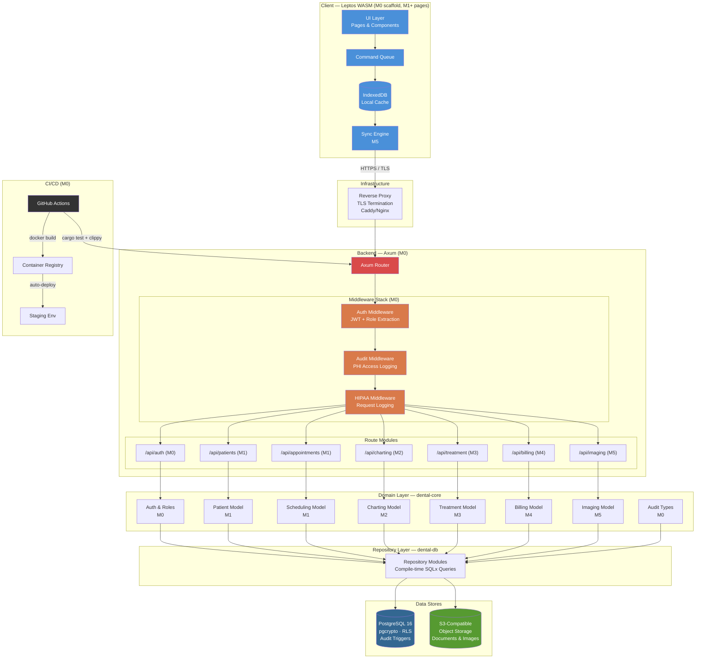

# Prompt: milestone-0-chief-architect-ai-2026-02-15-1

## Input
I am the chief architect at a company designing an architecture for milestone 0 from product_manager/product_manager.md. Create an initial proposal that won't need to be significantly reworked in later milestones. Additionally, include a mermaid diagram of final architecture.

## Output

# Architectural Proposal — Dental Practice Management System

## 1. Guiding Principles

1. **Build the skeleton now, flesh it out later.** Every milestone adds features to the same structural bones. No throwaway scaffolding.
2. **HIPAA from day zero.** Encryption, audit logging, and access control are not bolted on — they are the foundation layer everything else sits on.
3. **Offline-first mindset.** The data layer assumes intermittent connectivity from the start (M5 delivers the UX, but the write-ahead architecture is in place now).
4. **Domain boundaries map to milestones.** Each bounded context (patients, scheduling, charting, treatment, billing, imaging) lives in its own Rust module with a clean public API, so milestone teams never block each other.

---

## 2. Tech Stack Decisions

| Layer | Choice | Rationale |
|---|---|---|
| **Language** | Rust | Required per milestone plan. Memory safety, performance, strong type system for a healthcare-critical domain. |
| **Web Framework** | Axum | Tokio-native, tower middleware ecosystem, modular router composition maps well to bounded contexts. |
| **Database** | PostgreSQL 16 | JSONB for flexible clinical data, row-level security for RBAC, pgcrypto for encryption at rest, mature audit trigger support. |
| **ORM / Query** | SQLx | Compile-time checked queries against real Postgres. No runtime ORM magic — critical for a system where data correctness is a legal requirement. |
| **Migrations** | SQLx migrations | Keeps migration tooling in the same ecosystem. Versioned, reversible, checked into source control. |
| **Frontend** | Leptos (Rust → WASM) | Full-stack Rust. Server-side rendering for initial load, hydration for interactivity. Desktop-first keyboard-driven UI per requirements. |
| **Auth** | Argon2id password hashing + JWT sessions | Argon2id is OWASP-recommended. Short-lived JWTs with refresh tokens. Session table for revocation. |
| **Async Runtime** | Tokio | Industry standard for async Rust. Powers Axum, SQLx, and background task processing. |
| **File Storage** | Local filesystem (dev) / S3-compatible (staging/prod) | Abstracted behind a `StorageBackend` trait from day one. Serves M1 document uploads and M5 radiograph images. |
| **CI/CD** | GitHub Actions | Cargo check, clippy, test, sqlx prepare, docker build. Staging auto-deploy on merge to `main`. |
| **Containerization** | Docker + Docker Compose | Reproducible dev environment. Postgres, app server, and (future) object storage in one `docker compose up`. |

---

## 3. Project Structure

```
dental/
├── Cargo.toml                  # Workspace root
├── crates/
│   ├── dental-server/          # Axum application, routing, middleware
│   │   └── src/
│   │       ├── main.rs
│   │       ├── config.rs       # Environment / secrets loading
│   │       ├── middleware/
│   │       │   ├── auth.rs     # JWT extraction, role gate
│   │       │   ├── audit.rs    # Request-level audit logging
│   │       │   └── hipaa.rs    # PHI access logging middleware
│   │       └── routes/
│   │           ├── mod.rs      # Router composition
│   │           ├── auth.rs     # Login, logout, refresh
│   │           ├── patients.rs # M1
│   │           ├── scheduling.rs # M1
│   │           ├── charting.rs # M2
│   │           ├── treatment.rs # M3
│   │           ├── billing.rs  # M4
│   │           └── imaging.rs  # M5
│   ├── dental-core/            # Domain logic, zero framework dependencies
│   │   └── src/
│   │       ├── lib.rs
│   │       ├── models/         # Domain types (not DB rows)
│   │       │   ├── patient.rs
│   │       │   ├── provider.rs
│   │       │   ├── appointment.rs
│   │       │   ├── procedure.rs
│   │       │   ├── tooth.rs
│   │       │   ├── perio.rs
│   │       │   ├── treatment_plan.rs
│   │       │   ├── billing.rs
│   │       │   └── imaging.rs
│   │       ├── auth/
│   │       │   ├── roles.rs    # Role enum + permission matrix
│   │       │   └── session.rs
│   │       └── audit/
│   │           └── log.rs      # Audit event types
│   ├── dental-db/              # Repository layer — all SQL lives here
│   │   └── src/
│   │       ├── lib.rs
│   │       ├── pool.rs         # Connection pool setup
│   │       ├── repo/
│   │       │   ├── patients.rs
│   │       │   ├── providers.rs
│   │       │   ├── appointments.rs
│   │       │   ├── procedures.rs
│   │       │   ├── charting.rs
│   │       │   ├── treatment.rs
│   │       │   ├── billing.rs
│   │       │   ├── imaging.rs
│   │       │   └── audit.rs
│   │       └── migrations/
│   │           ├── 001_roles_and_users.sql
│   │           ├── 002_patients.sql
│   │           ├── 003_providers_operatories.sql
│   │           ├── 004_scheduling.sql
│   │           ├── 005_cdt_codes.sql
│   │           ├── 006_charting.sql
│   │           ├── 007_treatment_plans.sql
│   │           ├── 008_billing.sql
│   │           ├── 009_imaging.sql
│   │           └── 010_audit_log.sql
│   ├── dental-frontend/        # Leptos WASM frontend
│   │   └── src/
│   │       ├── app.rs
│   │       ├── components/     # Reusable UI components
│   │       ├── pages/          # Route-level views
│   │       └── api.rs          # HTTP client to backend
│   └── dental-common/          # Shared types between frontend/backend
│       └── src/
│           ├── lib.rs
│           ├── dto.rs          # API request/response types
│           └── validation.rs   # Shared validation rules
├── migrations/                 # SQLx migration files (symlink or copy)
├── docker-compose.yml
├── Dockerfile
└── .github/workflows/ci.yml
```

### Why This Structure

- **`dental-core`** has zero dependencies on Axum, SQLx, or Leptos. Domain logic is testable in isolation. When milestone teams add charting (M2) or billing (M4), they add domain types here without touching the web layer.
- **`dental-db`** owns all SQL. Repository functions return domain types from `dental-core`. Swapping databases (unlikely but possible) means rewriting one crate.
- **`dental-server`** composes routes and middleware. Each milestone's routes are a separate file that plugs into the router — no merge conflicts across teams.
- **`dental-common`** shares DTOs and validation between frontend and backend. Full-stack Rust means the same validation code runs on both sides.

---

## 4. Database Schema (Milestone 0 Scope — with forward stubs)

All tables include `created_at`, `updated_at`, `created_by`, `updated_by` for audit. Clinical tables additionally include `version` for optimistic concurrency and edit history.

### Core Tables (Built in M0)

```sql
-- Roles and Authentication
CREATE TYPE user_role AS ENUM ('receptionist', 'hygienist', 'dentist', 'admin');

CREATE TABLE users (
    id            UUID PRIMARY KEY DEFAULT gen_random_uuid(),
    username      VARCHAR(100) UNIQUE NOT NULL,
    password_hash VARCHAR(255) NOT NULL,  -- Argon2id
    role          user_role NOT NULL,
    is_active     BOOLEAN NOT NULL DEFAULT true,
    created_at    TIMESTAMPTZ NOT NULL DEFAULT now(),
    updated_at    TIMESTAMPTZ NOT NULL DEFAULT now()
);

-- Providers (dentists, hygienists — linked to users)
CREATE TABLE providers (
    id         UUID PRIMARY KEY DEFAULT gen_random_uuid(),
    user_id    UUID NOT NULL REFERENCES users(id),
    npi        VARCHAR(10),  -- National Provider Identifier
    license_no VARCHAR(50),
    specialty  VARCHAR(100),
    created_at TIMESTAMPTZ NOT NULL DEFAULT now(),
    updated_at TIMESTAMPTZ NOT NULL DEFAULT now()
);

-- Operatories (treatment rooms)
CREATE TABLE operatories (
    id         UUID PRIMARY KEY DEFAULT gen_random_uuid(),
    name       VARCHAR(50) NOT NULL,  -- "Op 1", "Hygiene A"
    is_active  BOOLEAN NOT NULL DEFAULT true,
    created_at TIMESTAMPTZ NOT NULL DEFAULT now()
);

-- Patients
CREATE TABLE patients (
    id                UUID PRIMARY KEY DEFAULT gen_random_uuid(),
    first_name        VARCHAR(100) NOT NULL,
    last_name         VARCHAR(100) NOT NULL,
    date_of_birth     DATE NOT NULL,
    phone             VARCHAR(20),
    email             VARCHAR(255),
    address_line1     VARCHAR(255),
    address_line2     VARCHAR(255),
    city              VARCHAR(100),
    state             VARCHAR(2),
    zip               VARCHAR(10),
    emergency_contact JSONB,      -- {name, phone, relationship}
    guarantor_id      UUID REFERENCES patients(id),
    is_active         BOOLEAN NOT NULL DEFAULT true,
    created_at        TIMESTAMPTZ NOT NULL DEFAULT now(),
    updated_at        TIMESTAMPTZ NOT NULL DEFAULT now(),
    created_by        UUID NOT NULL REFERENCES users(id),
    updated_by        UUID NOT NULL REFERENCES users(id)
);

-- ADA CDT Codes (seeded reference data)
CREATE TABLE cdt_codes (
    code        VARCHAR(10) PRIMARY KEY,  -- "D0120", "D1110"
    category    VARCHAR(100) NOT NULL,
    description TEXT NOT NULL,
    is_active   BOOLEAN NOT NULL DEFAULT true
);

-- Audit Log (immutable append-only)
CREATE TABLE audit_log (
    id          BIGSERIAL PRIMARY KEY,
    user_id     UUID REFERENCES users(id),
    action      VARCHAR(50) NOT NULL,     -- 'CREATE', 'READ', 'UPDATE', 'DELETE'
    entity_type VARCHAR(50) NOT NULL,     -- 'patient', 'appointment', etc.
    entity_id   UUID,
    old_value   JSONB,
    new_value   JSONB,
    ip_address  INET,
    occurred_at TIMESTAMPTZ NOT NULL DEFAULT now()
);

-- Index for audit queries
CREATE INDEX idx_audit_log_entity ON audit_log(entity_type, entity_id);
CREATE INDEX idx_audit_log_user   ON audit_log(user_id, occurred_at);
```

### Forward-Looking Tables (Schema defined in M0, populated in later milestones)

```sql
-- Appointments (M1)
CREATE TABLE appointments (
    id            UUID PRIMARY KEY DEFAULT gen_random_uuid(),
    patient_id    UUID NOT NULL REFERENCES patients(id),
    provider_id   UUID NOT NULL REFERENCES providers(id),
    operatory_id  UUID REFERENCES operatories(id),
    appointment_type VARCHAR(50) NOT NULL,
    starts_at     TIMESTAMPTZ NOT NULL,
    ends_at       TIMESTAMPTZ NOT NULL,
    status        VARCHAR(20) NOT NULL DEFAULT 'scheduled',
        -- scheduled, confirmed, checked_in, in_progress, completed, cancelled, no_show
    notes         TEXT,
    created_at    TIMESTAMPTZ NOT NULL DEFAULT now(),
    updated_at    TIMESTAMPTZ NOT NULL DEFAULT now(),
    created_by    UUID NOT NULL REFERENCES users(id),
    updated_by    UUID NOT NULL REFERENCES users(id)
);

-- Medical History (M1)
CREATE TABLE medical_histories (
    id          UUID PRIMARY KEY DEFAULT gen_random_uuid(),
    patient_id  UUID NOT NULL REFERENCES patients(id),
    medications JSONB NOT NULL DEFAULT '[]',
    allergies   JSONB NOT NULL DEFAULT '[]',
    conditions  JSONB NOT NULL DEFAULT '[]',
    version     INT NOT NULL DEFAULT 1,
    created_at  TIMESTAMPTZ NOT NULL DEFAULT now(),
    updated_at  TIMESTAMPTZ NOT NULL DEFAULT now(),
    updated_by  UUID NOT NULL REFERENCES users(id)
);

-- Tooth Chart (M2)
CREATE TABLE tooth_conditions (
    id          UUID PRIMARY KEY DEFAULT gen_random_uuid(),
    patient_id  UUID NOT NULL REFERENCES patients(id),
    tooth_num   SMALLINT NOT NULL,  -- 1-32 adult, A-T primary mapped to 33-52
    surface     VARCHAR(10),        -- M, O, D, B, L combinations
    condition   VARCHAR(50) NOT NULL, -- caries, missing, restoration, crown, etc.
    material    VARCHAR(50),
    notes       TEXT,
    recorded_at TIMESTAMPTZ NOT NULL DEFAULT now(),
    recorded_by UUID NOT NULL REFERENCES users(id),
    version     INT NOT NULL DEFAULT 1
);

-- Perio Charting (M2)
CREATE TABLE perio_exams (
    id          UUID PRIMARY KEY DEFAULT gen_random_uuid(),
    patient_id  UUID NOT NULL REFERENCES patients(id),
    exam_date   DATE NOT NULL,
    recorded_by UUID NOT NULL REFERENCES users(id),
    created_at  TIMESTAMPTZ NOT NULL DEFAULT now()
);

CREATE TABLE perio_measurements (
    id            UUID PRIMARY KEY DEFAULT gen_random_uuid(),
    exam_id       UUID NOT NULL REFERENCES perio_exams(id),
    tooth_num     SMALLINT NOT NULL,
    site          VARCHAR(5) NOT NULL,  -- DB, B, MB, DL, L, ML (6 sites per tooth)
    pocket_depth  SMALLINT,
    recession     SMALLINT,
    bleeding      BOOLEAN DEFAULT false,
    suppuration   BOOLEAN DEFAULT false
);

-- Progress Notes (M2)
CREATE TABLE progress_notes (
    id          UUID PRIMARY KEY DEFAULT gen_random_uuid(),
    patient_id  UUID NOT NULL REFERENCES patients(id),
    visit_date  DATE NOT NULL,
    author_id   UUID NOT NULL REFERENCES users(id),
    content     TEXT NOT NULL,
    template_id UUID,   -- future: note templates
    version     INT NOT NULL DEFAULT 1,
    created_at  TIMESTAMPTZ NOT NULL DEFAULT now(),
    updated_at  TIMESTAMPTZ NOT NULL DEFAULT now()
);

-- Treatment Plans (M3)
CREATE TABLE treatment_plans (
    id           UUID PRIMARY KEY DEFAULT gen_random_uuid(),
    patient_id   UUID NOT NULL REFERENCES patients(id),
    created_by   UUID NOT NULL REFERENCES users(id),
    status       VARCHAR(20) NOT NULL DEFAULT 'proposed',
        -- proposed, accepted, in_progress, completed, declined
    consent_date DATE,
    notes        TEXT,
    created_at   TIMESTAMPTZ NOT NULL DEFAULT now(),
    updated_at   TIMESTAMPTZ NOT NULL DEFAULT now()
);

CREATE TABLE treatment_plan_procedures (
    id               UUID PRIMARY KEY DEFAULT gen_random_uuid(),
    plan_id          UUID NOT NULL REFERENCES treatment_plans(id),
    cdt_code         VARCHAR(10) NOT NULL REFERENCES cdt_codes(code),
    tooth_num        SMALLINT,
    surface          VARCHAR(10),
    sequence_order   INT NOT NULL,
    status           VARCHAR(20) NOT NULL DEFAULT 'planned',
        -- planned, scheduled, in_progress, completed
    fee              DECIMAL(10,2),
    notes            TEXT,
    completed_at     TIMESTAMPTZ,
    completed_by     UUID REFERENCES users(id)
);

-- Billing (M4)
CREATE TABLE insurance_policies (
    id              UUID PRIMARY KEY DEFAULT gen_random_uuid(),
    patient_id      UUID NOT NULL REFERENCES patients(id),
    carrier_name    VARCHAR(200) NOT NULL,
    group_number    VARCHAR(50),
    subscriber_id   VARCHAR(50) NOT NULL,
    subscriber_name VARCHAR(200),
    relationship    VARCHAR(20),  -- self, spouse, child, other
    is_primary      BOOLEAN NOT NULL DEFAULT true,
    effective_date  DATE,
    expiry_date     DATE,
    created_at      TIMESTAMPTZ NOT NULL DEFAULT now(),
    updated_at      TIMESTAMPTZ NOT NULL DEFAULT now()
);

CREATE TABLE ledger_entries (
    id              UUID PRIMARY KEY DEFAULT gen_random_uuid(),
    patient_id      UUID NOT NULL REFERENCES patients(id),
    entry_type      VARCHAR(20) NOT NULL,  -- charge, payment, adjustment
    amount          DECIMAL(10,2) NOT NULL,
    cdt_code        VARCHAR(10) REFERENCES cdt_codes(code),
    procedure_id    UUID,  -- FK to treatment_plan_procedures
    payment_method  VARCHAR(20),  -- cash, card, check, insurance
    reference_no    VARCHAR(100),
    notes           TEXT,
    entry_date      DATE NOT NULL,
    created_at      TIMESTAMPTZ NOT NULL DEFAULT now(),
    created_by      UUID NOT NULL REFERENCES users(id)
);

-- Document / Image Storage (M1 docs, M5 radiographs)
CREATE TABLE documents (
    id           UUID PRIMARY KEY DEFAULT gen_random_uuid(),
    patient_id   UUID NOT NULL REFERENCES patients(id),
    doc_type     VARCHAR(50) NOT NULL,  -- id_scan, consent_form, radiograph, photo
    file_name    VARCHAR(255) NOT NULL,
    storage_key  VARCHAR(500) NOT NULL, -- path in storage backend
    mime_type    VARCHAR(100),
    file_size    BIGINT,
    notes        TEXT,
    uploaded_at  TIMESTAMPTZ NOT NULL DEFAULT now(),
    uploaded_by  UUID NOT NULL REFERENCES users(id)
);
```

---

## 5. Authentication & Role-Based Access Control

### Permission Matrix

| Resource | Receptionist | Hygienist | Dentist | Admin |
|---|---|---|---|---|
| Patient demographics | CRUD | Read | Read | CRUD |
| Medical history | Read | CRUD | CRUD | CRUD |
| Scheduling | CRUD | Read (own) | Read (own) | CRUD |
| Tooth chart | — | CRUD | CRUD | Read |
| Perio charting | — | CRUD | Read | Read |
| Progress notes | — | CRUD (own) | CRUD (own) | Read |
| Treatment plans | Read | Read | CRUD | Read |
| Billing/Ledger | CRUD | — | Read | CRUD |
| Insurance | CRUD | — | Read | CRUD |
| Documents | CRUD | CRUD | CRUD | CRUD |
| Audit log | — | — | — | Read |
| User management | — | — | — | CRUD |

### Implementation

```rust
// dental-core/src/auth/roles.rs

#[derive(Debug, Clone, Copy, PartialEq, Eq, sqlx::Type, Serialize, Deserialize)]
#[sqlx(type_name = "user_role", rename_all = "lowercase")]
pub enum Role {
    Receptionist,
    Hygienist,
    Dentist,
    Admin,
}

#[derive(Debug, Clone, Copy)]
pub enum Permission {
    PatientRead, PatientWrite,
    MedicalHistoryRead, MedicalHistoryWrite,
    ScheduleRead, ScheduleWrite,
    ChartRead, ChartWrite,
    PerioRead, PerioWrite,
    NotesRead, NotesWrite,
    TreatmentPlanRead, TreatmentPlanWrite,
    BillingRead, BillingWrite,
    InsuranceRead, InsuranceWrite,
    DocumentRead, DocumentWrite,
    AuditRead,
    UserManage,
}

impl Role {
    pub fn has_permission(self, perm: Permission) -> bool {
        use Permission::*;
        use Role::*;
        matches!((self, perm),
            // All roles read patients and documents
            (_, PatientRead | DocumentRead | DocumentWrite) |
            // Receptionist
            (Receptionist, PatientWrite | ScheduleRead | ScheduleWrite |
                           BillingRead | BillingWrite |
                           InsuranceRead | InsuranceWrite |
                           MedicalHistoryRead | TreatmentPlanRead) |
            // Hygienist
            (Hygienist, MedicalHistoryRead | MedicalHistoryWrite |
                        ScheduleRead | ChartRead | ChartWrite |
                        PerioRead | PerioWrite |
                        NotesRead | NotesWrite | TreatmentPlanRead) |
            // Dentist
            (Dentist, MedicalHistoryRead | MedicalHistoryWrite |
                      ScheduleRead | ChartRead | ChartWrite |
                      PerioRead | NotesRead | NotesWrite |
                      TreatmentPlanRead | TreatmentPlanWrite |
                      BillingRead | InsuranceRead) |
            // Admin — everything
            (Admin, _)
        )
    }
}
```

JWT middleware extracts the role from the token and injects it into Axum's request extensions. Route handlers call `role.has_permission(...)` before executing. This is enforced at the middleware level so individual handlers can't forget.

---

## 6. HIPAA-Aligned Infrastructure

| Requirement | Implementation |
|---|---|
| **Encryption in transit** | TLS termination at reverse proxy (nginx/Caddy). All internal traffic over localhost or TLS. |
| **Encryption at rest** | PostgreSQL `pgcrypto` + full-disk encryption on storage volumes. S3 server-side encryption for file storage. |
| **Audit logging** | Every CUD operation on clinical data writes to `audit_log` via database triggers + application-level middleware. Audit table is append-only (no UPDATE/DELETE grants). |
| **Access controls** | Role-based permission matrix (above). Row-level access verified in repository layer. |
| **PHI access logging** | Middleware logs every access to patient-identifiable data with user ID, timestamp, IP, and entity accessed. |
| **Session management** | JWTs expire in 15 minutes. Refresh tokens in 8 hours. Explicit logout invalidates refresh token. Idle timeout at 10 minutes for frontend. |
| **Password policy** | Argon2id hashing. Minimum 12 characters. Breach-check against HaveIBeenPwned k-anonymity API on registration. |

---

## 7. Offline Resilience Architecture (M0 Foundation → M5 Delivery)

The write-ahead queue is designed in M0 so that all data access patterns go through it from the start. M5 adds the sync UI and conflict resolution.

```
┌─────────────────────────────────────────┐
│              Leptos Frontend             │
│  ┌─────────┐   ┌──────────────────────┐ │
│  │ UI Layer │──▶│ Command Queue (WASM) │ │
│  └─────────┘   └──────────┬───────────┘ │
│                           │              │
│              ┌────────────▼───────────┐  │
│              │  IndexedDB (local)     │  │
│              │  - pending writes      │  │
│              │  - cached reads        │  │
│              └────────────┬───────────┘  │
│                           │ online?      │
│              ┌────────────▼───────────┐  │
│              │  Sync Engine           │  │
│              │  - batch POST on       │  │
│              │    reconnect           │  │
│              │  - conflict detection  │  │
│              └────────────┬───────────┘  │
└───────────────────────────┼──────────────┘
                            │ HTTPS
                ┌───────────▼───────────┐
                │     Axum Backend      │
                └───────────────────────┘
```

In M0, the `dental-common` crate defines the `Command` trait and serializable operation types. The frontend always writes through the command queue, even when online — this means M5 doesn't require rearchitecting the data flow.

---

## 8. CI/CD Pipeline

```yaml
# .github/workflows/ci.yml (simplified)
stages:
  check:    cargo fmt --check && cargo clippy -- -D warnings
  test:     cargo test --workspace (with dockerized Postgres via services)
  sqlx:     cargo sqlx prepare --check (ensures query cache is up to date)
  build:    cargo build --release
  docker:   docker build + push to registry
  deploy:   (staging) auto-deploy on merge to main
```

---

## 9. Final Architecture — Mermaid Diagram

This diagram represents the **complete MVP architecture** (M0–M6). Components delivered in each milestone are annotated.



---

## 10. What M0 Delivers vs. What It Prepares

| Component | M0 Delivers | Prepares For |
|---|---|---|
| **Project structure** | Cargo workspace with 5 crates | All milestones add to existing crates |
| **Database schema** | users, providers, operatories, patients, cdt_codes, audit_log | M1–M5 tables defined in migrations, ready to populate |
| **Auth + RBAC** | Login, JWT, role-based middleware, permission matrix | Every future route automatically protected |
| **Audit logging** | Append-only audit_log table + triggers + middleware | Clinical data in M2–M3 inherits audit coverage |
| **CDT codes** | Seeded reference table | M2 charting, M3 treatment, M4 billing all reference it |
| **File storage trait** | `StorageBackend` trait with local FS implementation | M1 doc uploads, M5 radiographs plug in without refactor |
| **Command queue types** | `Command` trait + serializable ops in dental-common | M5 offline mode uses the same write path |
| **CI/CD** | Full pipeline: check, test, build, deploy | Every milestone merges through the same pipeline |
| **Docker Compose** | Dev env with Postgres + app server | Add services (object storage, etc.) as needed |
| **Frontend scaffold** | Leptos app shell with routing, auth pages, role-aware nav | M1+ adds pages to existing router |

---

## 11. Key Architectural Decisions That Prevent Rework

1. **Workspace crate separation (`core` / `db` / `server` / `frontend` / `common`)** — Domain logic never depends on infrastructure. When M2 adds perio charting, it's a new file in `dental-core/src/models/` and `dental-db/src/repo/`, not a rewrite of the server.

2. **All SQL in `dental-db`** — No ORM migrations that generate opaque SQL. Every query is compile-time checked by SQLx. Schema changes are explicit, reviewable, and reversible.

3. **Permission matrix as a single `match` expression** — Adding a new permission for M3 treatment plans is a one-line change. No permission config files to keep in sync.

4. **Audit logging at the middleware + trigger level** — Developers don't have to remember to log. Every route through the middleware stack is logged. Every INSERT/UPDATE/DELETE on clinical tables fires a trigger. This means M2–M5 features are audit-compliant by default.

5. **`StorageBackend` trait abstraction** — M1 uploads documents, M5 uploads radiographs. Both use the same trait. Moving from local filesystem to S3 is a config change, not a code change.

6. **Command queue from day one** — Even in M0, writes go through a command pattern. This means M5's offline queue is a cache layer in front of the same write path, not a parallel system.

7. **JSONB for semi-structured clinical data** — Medical histories, emergency contacts, and (future) form responses use JSONB columns. This avoids schema migrations for every new field a hygienist needs to record.

---

## 12. Risks and Mitigations

| Risk | Impact | Mitigation |
|---|---|---|
| Leptos maturity | WASM framework is younger than React/Vue | Isolate frontend in its own crate. If Leptos proves problematic, swap to a JS frontend consuming the same REST API. |
| SQLx compile-time checks slow CI | Build times grow with query count | Use `cargo sqlx prepare` to cache query metadata. Parallelize CI stages. |
| CDT code licensing | ADA may restrict embedding D-code descriptions | Seed codes only (D0120, D1110, etc.) without full descriptions. Add description field later if licensed. |
| Schema forward-stubs unused for weeks | Tables exist with no application code | No cost — empty tables don't affect performance. Migrations are versioned and can be deferred if preferred. |
| Offline conflict resolution complexity | Two users edit same record offline | Optimistic concurrency via `version` column. Last-write-wins with conflict notification in M5. |
